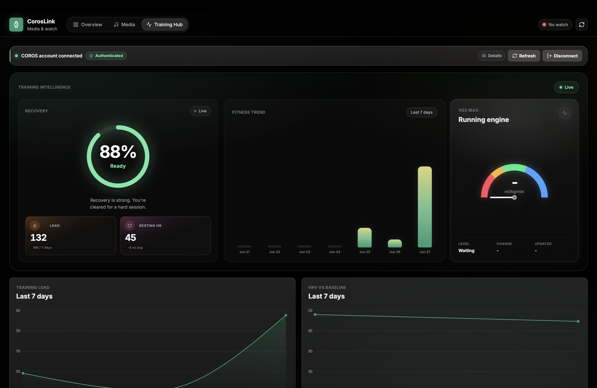
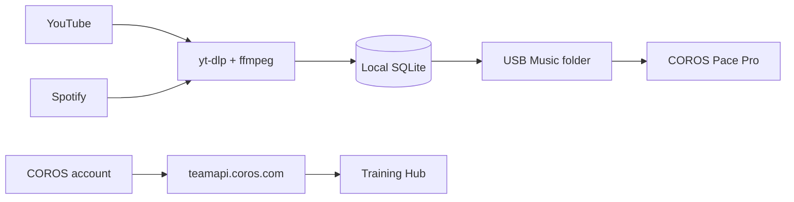

<p align="center">
  
</p>

<h1 align="center">CorosLink</h1>

<p align="center">
  <em>Your Pace Pro companion — media, watch sync, and training analytics in one desktop app.</em>
</p>

<p align="center">
  <strong>Live site:</strong> <a href="https://coroslink.vercel.app/">coroslink.vercel.app</a>
</p>

<p align="center">
  Unofficial desktop app for COROS Pace Pro owners. Not affiliated with or endorsed by COROS.
</p>

<p align="center">
  
  
  
  
  
</p>

<p align="center">
  
</p>

---

## Overview

CorosLink brings music management and training analytics together for your **COROS Pace Pro**. Connect your watch over USB, download MP3s from YouTube or Spotify playlists, transfer tracks in one click, and explore your training data in a rich dashboard — all from your Mac or PC.

---

## Features

### Overview — Dashboard at a glance

Your home screen for watch status, library metrics, and quick actions. See everything about your Pace Pro in one place.

- **Time-of-day greeting** with a Pace Pro hero image and live connection status
- **Storage ring** showing used space, free space, and 32 GB capacity
- **Metric tiles** for local library count, tracks on watch, transferred count, and library size
- **Quick actions** to jump into YouTube browsing or Spotify sync
- **Paste-a-link download** with optional auto-transfer to your watch
- **Recent downloads** with per-track transfer and delete actions

<p align="center">
  
</p>

---

### Media — Music manager

Download, organize, and sync MP3s to your watch. Three integrated workflows cover every way you add music.

#### Library

Your local MP3 collection, ready to transfer.

- **Full library table** with title, size, date, and watch sync status
- **Transfer single tracks** or **transfer all** pending downloads at once
- **Multi-select bulk delete** to clean up your local library

<p align="center">
  
</p>

#### YouTube

Browse YouTube inside the app and download MP3s without leaving the page.

- **Embedded YouTube browser** with back, forward, home, and search
- **Green MP3 buttons** injected on video thumbnails for one-tap downloads
- **Playlist download** support on watch and playlist pages
- **Background download queue** with live progress — keep browsing while tracks download

<p align="center">
  
</p>

#### Spotify

Sync your Spotify playlists to MP3s and your watch.

- **OAuth login** with your own Spotify Developer app credentials
- **Browse owned and collaborative playlists** with sync status
- **Auto-match tracks** via YouTube search (`<artist> <track> official audio`)
- **Optional auto-transfer** to your watch when connected over USB

<p align="center">
  
</p>

---

### Training Hub — COROS analytics dashboard

Log in with your COROS account to view training data, fitness scores, and race predictions — right on your desktop.

- **COROS account login** with email and password
- **Summary tiles** for Stamina, Recovery, Training Load, and Resting HR
- **Recovery readiness ring** with stamina overlay
- **7-day charts** for Training Load and HRV vs Baseline
- **EvoLab fitness scores** — Aerobic Endurance, Lactate Threshold, Anaerobic Endurance and Capacity
- **Race predictor** with estimated finish times by distance
- **Recent activities table** with a detail panel for laps, HR, elevation, and more
- **FIT file export** via signed download URL

<p align="center">
  
</p>

---

## How it works

CorosLink uses two independent data paths — USB for music, COROS APIs for training.



**Music sync** does not use an official COROS SDK. The app detects your watch when it mounts as a USB drive with a `Music` folder, then copies MP3 files directly.

**Training Hub** authenticates with COROS team APIs to fetch your analytics, activities, and fitness scores. Credentials are sent to COROS servers at login; all other app data stays on your machine.

---

## Install

### Download

Get the latest installer from **[GitHub Releases](https://github.com/JunAkerBuilds/CorosLink/releases)**:

| Platform | File |
| -------- | ---- |
| macOS (Apple Silicon) | `CorosLink-*-arm64.dmg` |
| Windows | `CorosLink Setup *.exe` |

#### macOS: “app is damaged” or won’t open

The app is **not** corrupted. macOS blocks unsigned apps downloaded from the internet. Fix it after installing:

```sh
xattr -cr "/Applications/CorosLink.app"
```

Then open normally. If that still fails, right-click the app → **Open** → **Open** again.

> Builds are unsigned (no Apple Developer certificate). A future signed release would skip this step.

Windows may show a SmartScreen prompt for unsigned installers — click **More info** → **Run anyway**.

### Build from source

```sh
git clone https://github.com/JunAkerBuilds/CorosLink.git
cd CorosLink
npm install
npm run rebuild
npm run dist:mac    # macOS DMG (run on macOS)
npm run dist:win    # Windows NSIS installer (run on Windows)
```

Installers are written to `release/`.

### Requirements

- **macOS** or **Windows**
- **USB cable** to connect your Pace Pro for music sync
- **yt-dlp** and **ffmpeg** — bundled in packaged builds; falls back to `PATH` if missing
- **Spotify Developer app** (optional) — only needed for Spotify playlist sync
- **COROS account** (optional) — only needed for Training Hub

---

## Privacy and data

- **Music and downloads** — stored locally in the Electron user data directory (SQLite database + MP3 files on disk)
- **Spotify tokens** — stored locally in SQLite after OAuth; never sent anywhere except Spotify
- **Training Hub** — your COROS email and password are used to authenticate with COROS servers. Activity data is fetched on demand and not synced to any third-party service
- **No cloud sync** — the app does not run its own backend or upload your files

> Only download media you have the rights or permission to download.

---

## Development

<details>
<summary><strong>Development setup</strong></summary>

```sh
npm install
npm run rebuild
npm run binaries:prepare
npm run dev
```

The dev command starts Vite at `http://127.0.0.1:5173/` and launches Electron. `npm run rebuild` prepares native SQLite bindings for Electron. `npm run binaries:prepare` downloads the current platform's standalone `yt-dlp` release asset and copies the `ffmpeg-static` binary into `bin/<platform>-<arch>/`.

To prepare Windows x64 media binaries from any platform:

```sh
npm run binaries:prepare:win
```

For hardware-free watch detection checks, set `COROS_WATCH_PATH=/path/to/mock-watch` with a `Music` folder, or run:

```sh
npm run smoke:watch
```

To regenerate README screenshots:

```sh
npm run build:electron
./node_modules/.bin/electron scripts/capture-readme-screenshots.cjs
```

</details>

<details>
<summary><strong>Spotify Developer setup</strong></summary>

Create a free Spotify app in the [Spotify Developer Dashboard](https://developer.spotify.com/dashboard), then add this redirect URI exactly:

```text
https://127.0.0.1:4567/callback
```

Paste the app's Client ID and Client Secret into the Spotify Sync view. The app opens a local OAuth login window and stores the resulting token locally in SQLite.

Playlist sync reads the authenticated user's playlists and only enables playlists that Spotify allows the user to read — currently playlists the user owns or collaborates on. Each track is searched on YouTube as `<artist> <track> official audio`, downloaded as an MP3, and saved as `Artist - Track Name.mp3`.

</details>

<details>
<summary><strong>Packaging</strong></summary>

```sh
npm run dist
```

Before packaging, run `npm run binaries:prepare`. The packaged app checks bundled binaries first, then falls back to `PATH`.

Convenience target scripts:

```sh
npm run dist:mac
npm run dist:win
```

For a quick local packaging layout check without code signing:

```sh
CSC_IDENTITY_AUTO_DISCOVERY=false npm run dist -- --dir
```

Because `better-sqlite3` is native, build Windows installers on Windows or in CI where Electron native dependencies can be rebuilt for the Windows target.

**Publishing a release (maintainers):**

1. Prepare the version in `package.json` and `package-lock.json` so they match the tag you are about to create:

```sh
npm run release:prepare -- v0.1.4
git commit -am "chore: release v0.1.4"
git tag v0.1.4
git push origin main v0.1.4
```

2. That triggers the [Release installers](.github/workflows/release.yml) workflow. CI syncs the tag into `package.json` before building, then verifies the versions match, so installer names like `CorosLink-0.1.4-arm64.dmg` always follow the git tag.

You can also run the workflow manually from **Actions → Release installers** (it uses the current `package.json` version when no tag is pushed).

Pushes to `main` run [Build desktop installers](.github/workflows/build.yml) and upload CI artifacts for testing before tagging.

</details>

---

<p align="center">
  Built with Electron, React, and Vite · CorosLink Contributors
</p>
